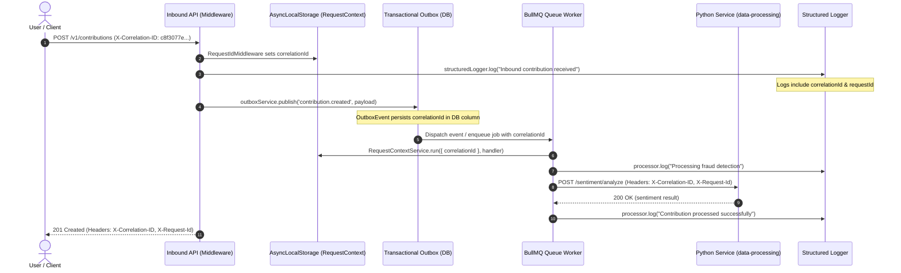

# Correlation ID & Structured Logging Tracing Guide (#1421)

## Overview

In Lumenpulse, a single user or system action can traverse multiple distributed components:
1. **HTTP Inbound API Gateway / Controllers**
2. **Transactional Outbox Table & Dispatcher**
3. **Queue Workers (BullMQ)**
4. **Soroban Smart Contract Indexer & Event Processor**
5. **Python Data Processing / ML Services** (`data-processing`)

Without an omnipresent correlation identifier carried across all hops, diagnosing a failed transaction requires correlating logs across different log streams and guessing at timestamps.

This guide explains how correlation IDs are generated, propagated, emitted into structured logs, and returned to API consumers for error reporting.

---

## Headers & Conventions

| Header | Format | Description |
|---|---|---|
| `X-Correlation-ID` | UUIDv4 (string) | Canonical header propagated across microservices, queue payloads, outbox events, and HTTP requests |
| `X-Request-Id` | UUIDv4 (string) | Supported synonym / alias for reverse proxy, load balancer, or API gateway compatibility |

Both headers are accepted interchangeably on incoming requests:
- If `X-Correlation-ID` is present, its value is extracted and used.
- Else if `X-Request-Id` is present, its value is extracted and used.
- If neither header is present, a fresh UUIDv4 is automatically generated.

Every API response, including error responses, echoes both `X-Correlation-ID` and `X-Request-Id` headers.

---

## Architecture & Propagation Flow



---

## Component Details

### 1. `RequestContextService` (`apps/backend/src/common/services/request-context.service.ts`)
Uses Node.js `AsyncLocalStorage` to store execution context across asynchronous boundaries without having to thread context parameters through every method signature:
- `RequestContextService.getCorrelationId()`
- `RequestContextService.getRequestId()`
- `RequestContextService.run({ correlationId, requestId }, callback)`

### 2. `StructuredLoggerService` (`apps/backend/src/common/services/structured-logger.service.ts`)
Injects `correlationId` and `requestId` automatically into all JSON log lines whenever available in the async local context:
```json
{
  "timestamp": "2026-09-23T17:24:35.000Z",
  "level": "INFO",
  "context": "SuspiciousContributionProcessor",
  "message": "Processing fraud detection for contribution in round 1",
  "correlationId": "c8f3077e-28b9-4674-8b65-6831d10e5d62",
  "requestId": "c8f3077e-28b9-4674-8b65-6831d10e5d62"
}
```

### 3. Transactional Outbox (`apps/backend/src/outbox/`)
- **Entity**: `OutboxEvent` includes a nullable `correlationId` column.
- **Publish**: `outboxService.publish()` captures `RequestContextService.getCorrelationId()`.
- **Dispatch**: `outboxService.dispatch()` restores the context using `RequestContextService.run({ correlationId })` so that event handlers inherit the original request's correlation ID.

### 4. BullMQ Queue Workers (`apps/backend/src/suspicious-contribution/`, `apps/backend/src/soroban-events/`)
- Job payloads include `correlationId?: string`.
- Queue processors wrap their worker logic in `RequestContextService.run({ correlationId: job.data.correlationId })`.

### 5. Outbound Python Service Client (`apps/backend/src/sentiment/`, `model-retraining/`, `read-model-rebuild/`)
- HTTP clients inject `X-Correlation-ID` and `X-Request-Id` headers on all outbound requests to `data-processing`.

### 6. Error Responses (`apps/backend/src/filters/global-exception.filter.ts`)
When an exception occurs, the error response payload returns `correlationId` and `requestId`:
```json
{
  "code": "SYS_007",
  "message": "Contribution amount exceeds maximum grant pool",
  "timestamp": "2026-09-23T17:24:35.026Z",
  "path": "/v1/contributions",
  "method": "POST",
  "correlationId": "c8f3077e-28b9-4674-8b65-6831d10e5d62",
  "requestId": "c8f3077e-28b9-4674-8b65-6831d10e5d62"
}
```
Users or client applications can quote this `correlationId` in support tickets or bug reports, allowing engineers to query all structured logs matching this ID across every service and worker.

---

## Verification & Worked Example

The end-to-end integration test is in `apps/backend/src/test/correlation-flow.spec.ts`.

To run the test:
```bash
export PATH="/home/timiturn3r/.nvm/versions/node/v22.23.1/bin:$PATH"
./node_modules/.bin/jest src/test/correlation-flow.spec.ts
```
